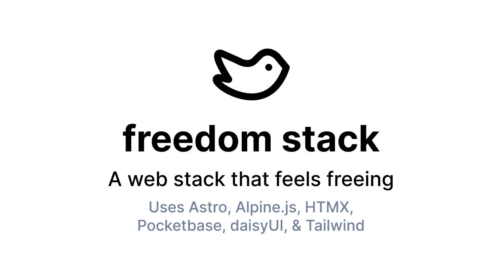

# WIP: freedom stack - a web stack that feels freeing

_Previously the Astwoah Stack_

[See Demo](https://freedom-stack.netlify.app/)

## Comes With

- Blog & CMS
- CSS-based component library (daisyUI)
- Database (Pocketbase)
- Simple Web Hosting (Netlify)

## Stack

### UI Layer

- [Astro](https://astro.build/) - A simple web metaframework.
- [Tailwind CSS](https://tailwindcss.com/) - For styling.
- [Daisy UI](https://daisyui.com/) - For a Bootstrap-like UI CSS component library, built upon Tailwind.

### Interactivity Layer

- [TypeScript](https://www.typescriptlang.org/) - For type safety.
- [AlpineJS](https://alpinejs.dev/) - For state management and interactivity.
- [HTMX](https://htmx.org/) - For sending HTML partials/snippets over the wire.

### Backend Data Layer

After deliberation, I have chosen [Pocketbase](https://pocketbase.io/). This is immensely easy to set up using [PocketHost](https://pockethost.io/) in a few minutes.

If you need a database that is just one set of data for everyone, then consider using [Baserow.io](https://baserow.io/), instead.

### Hosting

I have included the Netlify adapter in the starter kit. You can swap it out for others, such as Vercel.

## How To Use

To create your own instance of this codebase, click the "Use this template" button on the [repo's home page](https://github.com/cameronapak/astwoah-stack).

### Blog

Access your blog's CMS on the `/keystatic` path.

The blog is powered by [Keystatic CMS](https://keystatic.com/), which is a git-based content management system. 

- [ ] Connect your blog to GitHub mode: https://keystatic.com/docs/github-mode.

## Vision

I dream of a lightweight, simple web development stack that invokes a fun web experience at the cheapest possible maintainance, backend, and server cost. As close to free as possible.

### Core Principles

- **Approachable** — I want those new to web development to feel comfortable using this stack. Things like database management should feel intuitive. Remove barriers of traditional JavaScript frameworks, such as excessive boilerplate code or intense state management. Go back to the basics of web development. (_While this is not vanilla, the dev experience will feel very natural._)
- **Flow-able** — Use an HTML-first approach, where almost all of the work is done on the DOM layer: styling, structuring, and interactivity. An opinionated stack helps you avoid analysis paralysis of trying to decide what tooling to pick or how to put things together. Instead, spend your thinking time building. This simple stack helps you focus and get in the flow of code faster. Fast setup. Fast building. Fast shipping.
- **Pocket-friendly** — Using this stack will be financially maintainable to anyone, especially indie hackers and those creating startup sites / web apps. Any 3rd party integrations or backend as a service tooling chosen will have a generous free tier.

### Contributions

I'll consider a contribution, but please [open an issue](https://github.com/cameronapak/astwoah-stack/issues) if you'd like to contribute.
